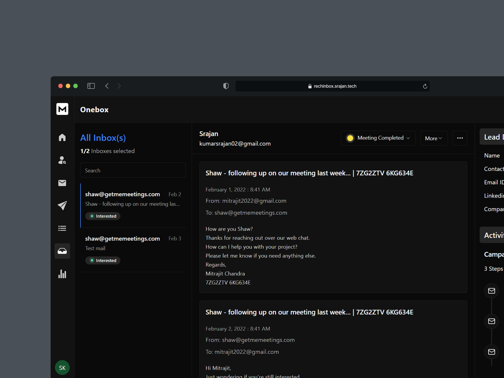
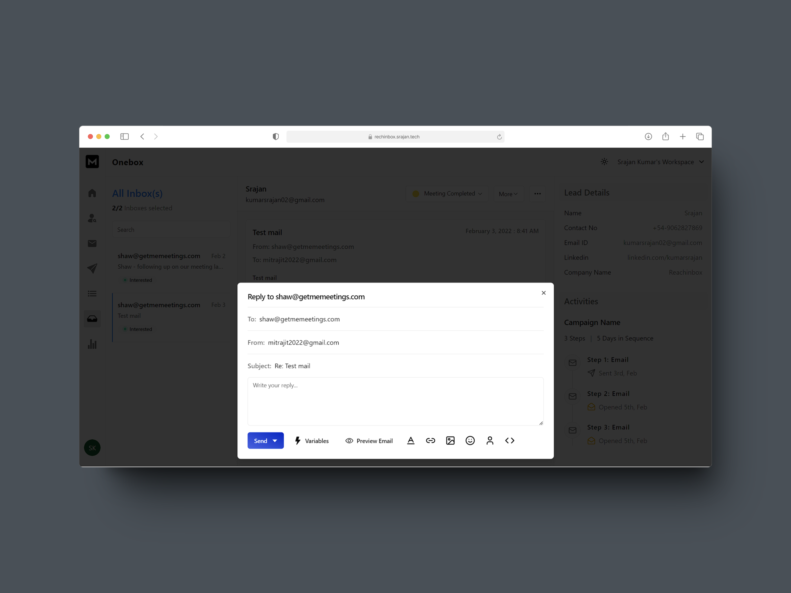
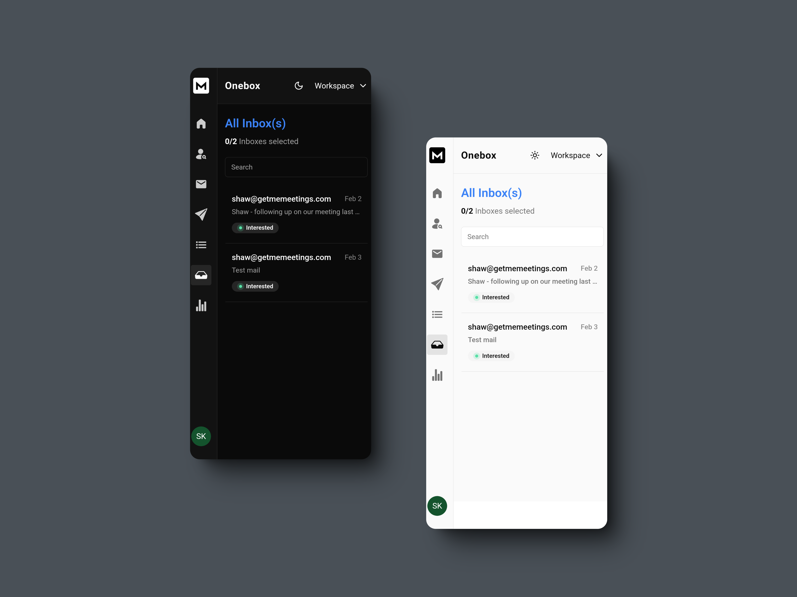

# ReachInbox Assignment

Welcome to my ReachInbox assignment! This project is a functional web app built based on the provided designs and APIs. Below you will find detailed information about the project, how to run it locally, the technologies used, and some mockups for better understanding.

In this project, I used [Next.js](https://github.com/vercel/next.js) for the frontend, [Postman](https://github.com/postmanlabs) for API testing, and [Shadcn UI](https://github.com/shadcn-ui/ui) for the user interface components, and deployed the application using [Vercel](https://github.com/vercel/vercel).

## Features Implemented

- **Login Page**  
  Implements the design and handles authentication.

- **Onebox Screen**  
  Fetches and displays data using API integration.

- **Keyboard Shortcuts**

  - Press `D` to delete a thread.
  - Press `R` to open the reply box.

- **Light and Dark Mode**  
  Toggle between themes to enhance user experience.

## Live Demo

You can check out the live version of the web app here:  
[Deployment Preview](https://reachinbox.srajan.tech)

## Source Code

The source code for the project is available in this GitHub repository:  
[Source Code - GitHub](https://github.com/srajankumar/reachinbox-assignment)

## Mockups

<div align="center">
  
</div>
<div align="center">
  
</div>
<div align="center">
  
</div>

For more screenshots, view [Google Drive](https://drive.google.com/drive/folders/1BMnmxIJVxdHrQrLwtIe0kjbyrXdjq6Y7)

## Technologies Used


## Installation

To run this project locally, follow these steps:

1. Clone the repository:

   ```bash
   git clone https://github.com/srajankumar/reachinbox-assignment.git
   ```

2. Navigate to the project directory:

   ```bash
   cd reachinbox-assignment
   ```

3. Install the dependencies:

   ```bash
   npm install
   ```

4. Create a `.env.local` file in the root of the project and add the following environment variable:

   ```bash
   NEXT_PUBLIC_CLIENT_URL=your_frontend_url
   ```

5. Start the development server:

   ```bash
   npm run dev
   ```

6. Open your browser and visit `http://localhost:3000` to view the app.

## Contact

Feel free to reach out if you have any questions or feedback on my project - [srajan.tech](https://srajan.tech)

> _Thank you for taking the time to review my assignment. I look forward to hearing back from you soon :)_
